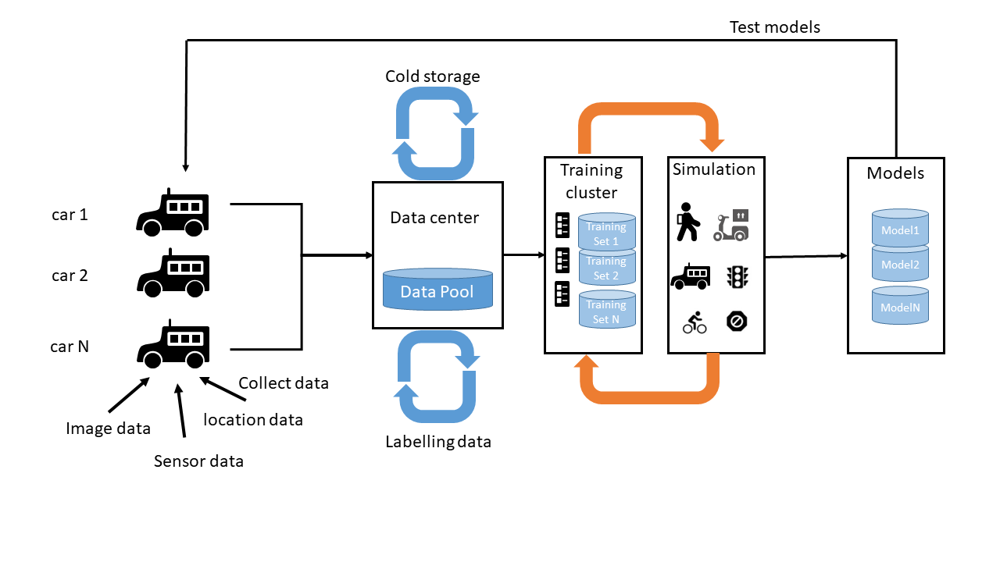

# Homework 1

**Title:** Autonomous vehicles system(self-driving)

## Define a problem

Only consider the self-driving system in a self-driving car, the problem here is defined as: how a self-driving car can make efficient and accident-free decisions(driving plan) via its pre-trained system.

**Volume:** innumerable data is collected from manual driving, computer simulation and system tests to feed the self-driving system. Literally, a big amount data is prepared to train such system.

**Variety:** different types of data work together to make the system function smoothly, including images from cameras, wave or other data collected by sensors, location and overall road condition transmitted via network/Internet, physical data(wheel data, road surface feedback) proposed by passengers. Various types of data are involved in self-driving system.

**Velocity**: either in test or in real-world driving, the system have to react to passenger's customized needs and real-time local road condition in light speed. While the former one influence the customer's experience, the latter one may pose safety problems if not reacted in a time short enough.

## Workflow

## Databases to be used

There're 2 stages that database will come to play.

**Stage 1:** prepare data to train the system

this stages will involve a heavy work in databases because various data is used in training the model, also the model itself needs to be stored for further review. Based on different types of data, the following databases could be used:

*Images from computer vision*: Graph database, saved in distributed databases

*System log, model data*: noSQL database, may have multiple copy, but should be centralized for security

*GPS and overall database*: SQL database, may be use a schema to record [location, weather, real-time congestion, etc. ]

*sensor data*: depend on data format, may use time series database because order counts in getting physical environment evaluation( e.g. use wave to detect obstacles)

And part of these data may use a distributed database like *Hadoop* or *Spark*, so that all data can be collected in case of future review.

**Stage 2:** real-world application

A light weight storage system will be designed, like RAM in a computer, used to communicate with local data center and deal with real-time computation of real-time input data collected by cameras or other sensors around the car. Also, a hard disk will also be deployed to make driving record, this will help engineer to find anomalies. In this design, the order of input and output data is important, so time series database may be used, however, for daily log, noSQL is more suitable. Also, the big data collected in stage 1 still play a role in this stage to cooperate with vehicle-computer.