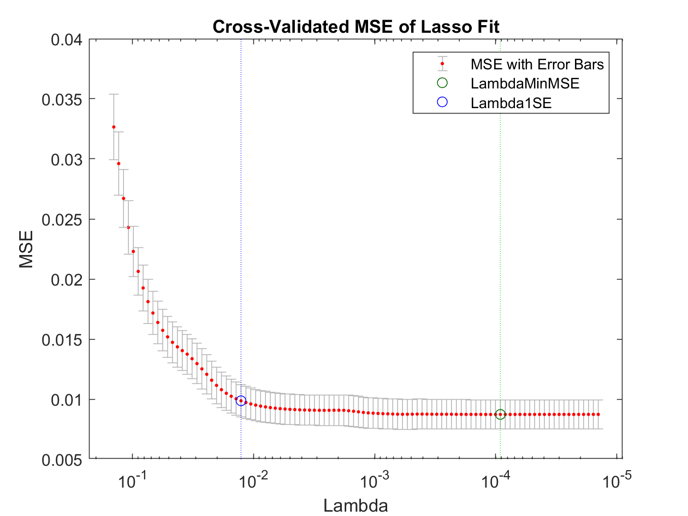

# Homework 2

## problem 1

### 1.1

**closed_form_1.m**

```matlab
function betas =  closed_form_1(Y,X)
    betas = (X'*X)\(X'*Y);
end
```

**compute closed form solution**

```matlab
climateChangeData = readtable('climate_change_1.csv','PreserveVariableName',1);
trainData = climateChangeData{climateChangeData.Year<=2006,:};
testData = climateChangeData{climateChangeData.Year>2006,:};

%create X and add constant column
Xtrain = trainData(:,3:10);
Xtrain = [ones(size(Xtrain,1),1),Xtrain];

Xtest = testData(:,3:10);
Xtest = [ones(size(Xtest,1),1),Xtest];

%create Y
Ytrain = trainData(:,11);
Ytest = testData(:,11);

%get closed form solution
betas = closed_form_1(Ytrain,Xtrain);
```

**solution**

```matlab
>> betas

betas =

 -113.8040
    0.0642
    0.0065
    0.0109
   -0.0165
   -0.0066
    0.0038
    0.0931
   -1.5376
  -10.7902
```


### 1.2

**linear model**

$$Y = X\beta + \epsilon$$

where $\epsilon \sim MVN(0,\sigma^2I)$

in most cases, it is required no outliers existing in the linear model.

**evaluate $R^2$ **

$R^2 = \frac{SSR}{SST} = \frac{\sum(\hat{y_i} - \bar{y_i})^2}{\sum(y_i - \bar{y_i})^2}$

```matlab
whichstats = {'rsquare'};
% model R^2 of training model
trainRSquared = regstats(Ytrain, Xtrain, 'linear', whichstats);
trainRSquared = trainRSquared.rsquare;

% model R^2 of test model
YtestHat = Xtest*betas;
SSR = sum((YtestHat - mean(Ytest)).^2);
SST = sum((Ytest - mean(Ytest)).^2);
testRSquared = SSR / SST;
```

**solution**

```matlab
>> trainRSquared

trainRSquared =

    0.7505

>> testRSquared

testRSquared =

    0.2252
```


### 1.3

**hypothesis test**

Use t-stat to test $H_0$:$\beta= 0$, confidence level = 0.95

```matlab
whichstats = {'tstat'};

model = regstats(Ytrain, Xtrain, 'linear', whichstats);
modelPValue = model.tstat.pval;
indxSignificant = find(modelPValue<0.05);
```

**solution**

```matlab
>> climateChangeData.Properties.VariableNames{indxSignificant}

ans =

    'MEI'


ans =

    'CO2'


ans =

    'N2O'


ans =

    'CFC-11'


ans =

    'CFC-12'


ans =

    'TSI'


ans =

    'Aerosols'
```


### 1.4

**necessary condition**

$X^TX$ must be a full rank square matrix.

```matlab
% read another table
climateChangeData = readtable('climate_change_2.csv','PreserveVariableName',1);

% use same rule to generate train data
trainData = climateChangeData{climateChangeData.Year<=2006,:};
testData = climateChangeData{climateChangeData.Year>2006,:};

%create X and add constant column
Xtrain = trainData(:,3:11);
Xtrain = [ones(size(Xtrain,1),1),Xtrain];

Xtest = testData(:,3:11);
Xtest = [ones(size(Xtest,1),1),Xtest];

%create Y
Ytrain = trainData(:,12);
Ytest = testData(:,12);

%get closed form solution
betas = closed_form_1(Ytrain,Xtrain);
```

**why solution bad**
because rank(X'X) = 9, while size(X'X) = 10 x 10


## problem 2

### 2.1

**loss function**

$(Y - X\beta)^T(Y-X\beta)+\lambda\|\beta\|_p$

if p=1, L1 regularization; if p=2, L2 regularization


### 2.2

**closed_form_2.m**

```matlab
% solve L2 regularization
function betas = closed_form_2(Y,X,lambda)
    I = eye(size(X'*X,1));
    betas = (X'*X + lambda * I)\(X'*Y);
end
```


### 2.3

**computation experiment**

```matlab
climateChangeData = readtable('climate_change_1.csv','PreserveVariableName',1);
trainData = climateChangeData{climateChangeData.Year<=2006,:};
testData = climateChangeData{climateChangeData.Year>2006,:};

%create X and add constant column
Xtrain = trainData(:,3:10);
Xtrain = [ones(size(Xtrain,1),1),Xtrain];

Xtest = testData(:,3:10);
Xtest = [ones(size(Xtest,1),1),Xtest];

%create Y
Ytrain = trainData(:,11);
Ytest = testData(:,11);

beta_OLS = closed_form_1(Ytrain, Xtrain);
beta_L2 = closed_form_2(Ytrain, Xtrain, 10);

% display
disp("norm of betas:");
disp(norm(beta_OLS,2));
disp(norm(beta_L2,2));

% display test R^2
R2_OLS = sum((Xtest*beta_OLS - mean(Ytest)).^2)/sum((Ytest - mean(Ytest)).^2);
R2_L2 = sum((Xtest*beta_L2 - mean(Ytest)).^2)/sum((Ytest - mean(Ytest)).^2);
disp("R2 of OLS:");
disp(R2_OLS);
disp("R2 of L2:");
disp(R2_L2);
```

**solution**

```matlab
norm of betas:

OLS:
  124.6038
  
L2:
    0.0512

R2 of OLS:
    0.2252

R2 of L2:
    0.9409
```

It can be found, the 2-norm of coefficients in Ridge regression is mush more smaller than that of OLS regression, which means, in Ridge regression, the result will be less sensitive to change of single variable, making it more robust.


### 2.4

**evaluate model's $R^2$ on different lambdas**

```matlab
lambdaArray = [0.001,0.01,0.1,1,10];
for count = 1:length(lambdaArray)
    lambdaStruct = workFlow(Xtrain, Xtest, Ytrain, Ytest, lambdaArray(count));
    fN = "lambda" + num2str(count);
    R2Struct.(fN) = lambdaStruct;
end

%----------------details of functions used -------------------

% universal function, get different lambda(a scalar), return R^2 of
% training and testing data set
function R2TrainTest = workFlow(Xtrain, Xtest, Ytrain, Ytest, lambda)
    %get betas from training
    betas = closed_form_2(Ytrain, Xtrain, lambda);
    Yhat = Xtrain*betas;
    
    %get R2 of training set
    SSR_train = sum((Yhat - mean(Ytrain)).^2);
    SST_train = sum((Ytrain - mean(Ytrain)).^2);
    R2train = SSR_train / SST_train;
    
    %get Yhat of testing data set
    Yhat_test = Xtest*betas;
    
    %get R2 of test set
    SSR_test = sum((Yhat_test - mean(Ytest)).^2);
    SST_test = sum((Ytest - mean(Ytest)).^2);
    R2test = SSR_test / SST_test;
    
    R2TrainTest.lambda = lambda;
    R2TrainTest.train = R2train;
    R2TrainTest.test = R2test;
end
```

**solution1: different lambdas**

| lambda | $R^2$ training | $R^2$ test |
| ------ | -------------- | ---------- |
| 0.001  | 0.7148         | 0.5625     |
| 0.01   | 0.7117         | 0.5853     |
| 0.1    | 0.6945         | 0.6733     |
| 1      | 0.6795         | 0.8468     |
| 10     | 0.6746         | 0.9409     |

**decide best $\lambda$**

- step 1: as above, split data set into training and testing set
- step 2: use cross validation, split training data set into sub-training set and validation set.
- step 3: do cross validation, each time, train model on sub-training set and test on validation set, use mean of MSE on validation set as optimal measure, the model which has least mean of MSE will be picked as best model
- step 4: test model on independent test set

**code solution**

```matlab
% get best lambda
k = 5;
m = 30;
bestLambda = stochasticCV(Xtrain, Ytrain, k, m, lambdaArray);

% deploy best lambda on the test data
cvLambdaStruct = workFlow(Xtrain, Xtest, Ytrain, Ytest, bestLambda);
cvTrainR2 = cvLambdaStruct.train;
cvTestR2 = cvLambdaStruct.test;


%-----------details of functions below----------------------
% cross validation
function bestLambda = stochasticCV(Xtrain, Ytrain, k, m, lambdaArray)
    %for each lambda do:
    minMeanMSE = inf;
    bestLambda = lambdaArray(1);
    for lambda = lambdaArray
        kTimesMSE = zeros(1,k);
        % do k times evaluation
        for time = 1:k
            % cut training data
            shuffleIndex = randperm(size(Xtrain,1));
            XtrainSubset = Xtrain(shuffleIndex(m+1:end),:);
            YtrainSubset = Ytrain(shuffleIndex(m+1:end));
            Xvalidation = Xtrain(shuffleIndex(1:m),:);
            Yvalidation = Ytrain(shuffleIndex(1:m));
            
            % run regression on train subset, get betas
            betas = closed_form_2(YtrainSubset, XtrainSubset, lambda);
            % test MSE on validation data set
            SSE = sum((Yvalidation -  Xvalidation * betas).^2);
            kTimesMSE(time) = SSE / m;
        end
        % compare kTimes mean MSE
        meanMSE = mean(kTimesMSE);
        if meanMSE < minMeanMSE
            minMeanMSE = meanMSE;
            bestLambda = lambda;
        end
    end
end
```

**written solution**

```matlab
>> cvTrainR2

cvTrainR2 =

    0.7148

>> cvTestR2

cvTestR2 =

    0.5625
```


## problem 3

**feature selection**

use lasso model to do feature selection

work flow as follows:

- first set a loss measure, 1SE here(the variables in the sparsest model 
  % within one standard error of the minimum MSE.), to select potential model(with different lambda)
- use k-Fold cross validation, choose best lambda through minimize MSE and deploy the model on the test data set.

**code solution**

```matlab
% use LASSO to select features 
% first set a loss measure, 1SE here(the variables in the sparsest model 
% within one standard error of the minimum MSE.), to select potential models
% (with different lambda)
% use k-Fold cross validation, choose best lambda through minimize MSE and
% deplot the model on the test data set.
climateChangeData = readtable('climate_change_1.csv','PreserveVariableName',1);
trainData = climateChangeData{climateChangeData.Year<=2006,:};
testData = climateChangeData{climateChangeData.Year>2006,:};

%create X and add constant column
Xtrain = trainData(:,3:10);
% Xtrain = [ones(size(Xtrain,1),1),Xtrain];

Xtest = testData(:,3:10);
% Xtest = [ones(size(Xtest,1),1),Xtest];

%create Y
Ytrain = trainData(:,11);
Ytest = testData(:,11);

[B,FitInfo] = lasso(Xtrain,Ytrain,'CV',10);

lassoPlot(B,FitInfo,'PlotType','CV');
legend('show'); % Show legend

% fit model with new parameters
bestBetas = B(:,FitInfo.Index1SE);

% get R2 of test data
Yhat_test = Xtest*bestBetas + FitInfo.Intercept(FitInfo.Index1SE);
SST_test = sum((Ytest - mean(Ytest)).^2);
SSR_test = sum((Yhat_test - mean(Ytest)).^2);
R2test_LASSO = SSR_test / SST_test;
```



```matlab
>> R2test_LASSO

R2test_LASSO =

    0.8081
```


## problem 4
**Math solution**
$\nabla_{\beta} Cost = -2X^T Y + 2X^TX\beta$

$\beta_{i+1} = \beta_{i} - \alpha  \nabla_{\beta} Cost$
stop iteration if no significant improvement on cost function.

**code solution**

```matlab
% gradient descent function
function [x, funcVal] = homework2_problem4(func, x0, Ytrain, Xtrain)
% func: cost function, can be evaluate at given x, must return both value, should be callable, use string in this case.
% and gradient evaluated at given x, x is of size n x k
% x0: starting point, matrix, of size n x k, means n points in k dimension
    learningRate = 0.0001;
    iterMax = 1000;
    threshold = 1e-4;
    gap = 1000;
    
    x = x0;
    iterTimes = 0;
    while gap>threshold && iterTimes < iterMax     
        [funcVal, grad] = feval(func, x, Ytrain, Xtrain);
        xNew = x - learningRate*grad;
        gap = norm(Xtrain*xNew - Ytrain, 2);
        x = xNew;
        iterTimes = iterTimes + 1;
    end
end
```

